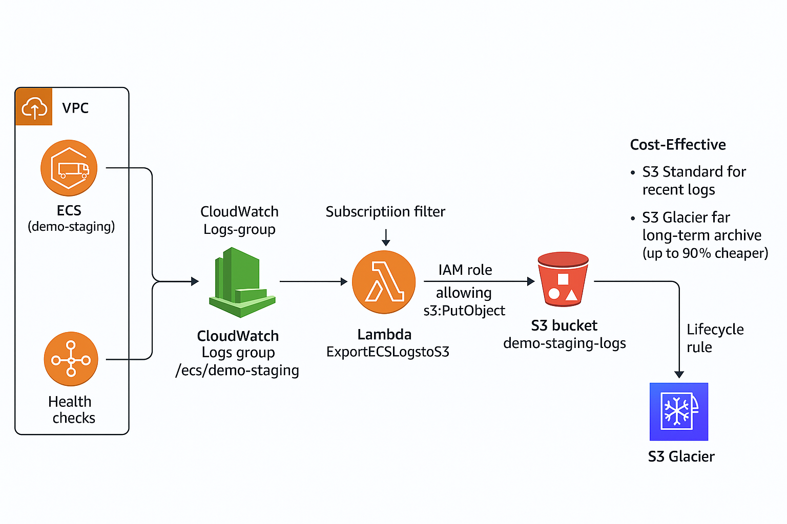

## 📊 Architecture Diagram
[](assets/architecture.png)


#  Export ECS Logs from CloudWatch to Amazon S3 (with Lambda & Glacier)

This project demonstrates how to automatically **stream ECS container logs** from **Amazon CloudWatch Logs** → **AWS Lambda** → **Amazon S3**, and then archive them into **Amazon S3 Glacier** for long-term, low-cost storage.  

It’s a **serverless, scalable, and cost-effective** logging pipeline that ensures your ECS logs are both available and affordable to keep for months or years.  

---

##  Workflow

**ECS → CloudWatch Logs → Lambda → S3 → Glacier**

1. **ECS (Elastic Container Service)**  
   - Service: `demo-staging`  
   - Task definitions push logs into CloudWatch Logs using the `awslogs` driver.  

2. **CloudWatch Logs**  
   - Collects logs in the log group:  
     ```
     /ecs/demo-staging
     ```
   - A **subscription filter** streams events to the Lambda function.  

3. **AWS Lambda**  
   - Decodes and parses log events.  
   - Uploads JSON log files into **Amazon S3** with a timestamp-based folder structure.  

4. **Amazon S3**  
   - Acts as centralized storage for ECS logs.  
   - Example path:  
     ```
     s3://demo-staging-logs/yyyy/mm/dd/hh/logs.json
     ```
   - A lifecycle rule transitions logs to **Amazon S3 Glacier** after 1 day.  

5. **Amazon S3 Glacier**  
   - Provides **durable, low-cost cold storage** for compliance, auditing, and future analytics.  

---

##  Setup Steps

### 1. ECS Service Logging  
- Configure ECS service `demo-staging` with the `awslogs` driver.  
- Ensure logs appear in CloudWatch Logs (`/ecs/demo-staging`).  

### 2. Lambda Function  
- Deploy the Lambda function (`ExportECSLogsToS3`).  
- Attach IAM role with:  
  - `s3:PutObject`  
  - `s3:PutObjectAcl`  
  - `s3:ListBucket`  
  - `s3:GetBucketLocation`  
- Configure CloudWatch Logs subscription to invoke Lambda.  

### 3. S3 Bucket & Lifecycle  
- Create an S3 bucket (`demo-staging-logs`).  
- Add lifecycle rules to **transition objects to Glacier** after 1 day.  

### 4. Verify the Pipeline  
- Trigger logs in ECS (`demo-staging` service).  
- Check S3 bucket → Logs appear in JSON format.  
- After 1 day → Logs transition to Glacier.  

---

##  Cost-Effectiveness

- **CloudWatch Logs** → Short-term buffer (charged per ingestion & storage).  
- **S3 Standard** → Stores recent logs for quick access.  
- **S3 Lifecycle → Glacier** → Automatically moves older logs to Glacier, which is **up to 90% cheaper** than keeping them in S3 Standard.  
- **Serverless Lambda** → Pay-per-invocation, scales automatically with log volume.  

 This pipeline ensures **real-time log streaming** with **minimal cost**, perfect for long-term auditing or compliance without overspending.  

---


